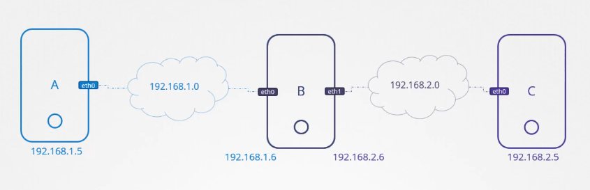

# Conhecimentos basicos de Redes
Os conceitos basicos serao divididos em topicos.  
- [Switching](#switching)
- [Routing](#routing)
- [DNS](#dns)
- [Dominios](#dominios)
- [Network Namespaces](#network-namespaces)
  
## **Switching**  
Quando falamos de switching temos o objetivos de comunicar um host com outro em uma rede. Para isso precisamos configurar o IP de ambos os hosts na interface de rede usada. Nesse caso vamos supor que estamos usando a rede por meio fisico (cabo).  
Primeiro verificamos as interfaces disponiveis no host:  
```sh
$ ip link 
...
2: eth0: <BROADCAST,MULTICAST,UP,LOWER_UP> mtu 1500 qdisc mq state UP mode DEFAULT group default qlen 1000
    link/ether dc:a6:32:94:2c:16 brd ff:ff:ff:ff:ff:ff
...
```  
Dentre elas temos a `eth0` responsavel pela interface com conexao fisica (cabo).  
Agora verificamos quais IPs estao anexados nas respectivas interfaces:  
```sh
$ ip addr show
...
2: eth0: <BROADCAST,MULTICAST,UP,LOWER_UP> mtu 1500 qdisc mq state UP group default qlen 1000
    link/ether dc:a6:32:94:2c:16 brd ff:ff:ff:ff:ff:ff
    inet 192.168.1.21/24 brd 192.168.1.255 scope global dynamic eth0
       valid_lft 61955sec preferred_lft 61955sec
    inet6 2001:1284:f028:799:dea6:32ff:fe94:2c16/64 scope global dynamic mngtmpaddr noprefixroute 
       valid_lft 86399sec preferred_lft 86399sec
    inet6 fe80::dea6:32ff:fe94:2c16/64 scope link 
       valid_lft forever preferred_lft forever
...
```  
Dentre varias opcoes encontramos o IP do nosso host `192.168.1.21/24` anexado a interface `eth0`.  
Isso significa que hosts que estiverem na mesma rede poderao se conectar com esse host atraves desse mesmo tipo de interface chamando por esse IP.  
  
Caso nao houvesse nenhum IP anexado a essa interface deveriamos adicionar esse IP nessa interface desejada:  
```sh
$ ip addr add 192.168.1.21 dev eth0
```  
A palavra `dev` significa `device` e define qual interface voce deseja adicionar esse endereco.  
  
**_Ok, mas e quando os hosts estao em redes diferentes? Como faco para conecta-los?_**  
Ai entra o roteamento...  
  
## Routing  
Quando queremos conectar hosts de redes diferentes precisamos usar um Router, para isso precisamos da nossa lista de IPs cadastrados no router para que a conexao funcione.  
```sh
$ route

Kernel IP routing table
Destination     Gateway         Genmask         Flags Metric Ref    Use Iface
default         _gateway        0.0.0.0         UG    100    0        0 eth0
default         _gateway        0.0.0.0         UG    600    0        0 wlan0
10.32.0.0       0.0.0.0         255.240.0.0     U     0      0        0 weave
172.17.0.0      0.0.0.0         255.255.0.0     U     0      0        0 docker0
192.168.1.0     0.0.0.0         255.255.255.0   U     0      0        0 eth0
192.168.1.0     0.0.0.0         255.255.255.0   U     0      0        0 wlan0
_gateway        0.0.0.0         255.255.255.255 UH    100    0        0 eth0
_gateway        0.0.0.0         255.255.255.255 UH    600    0        0 wlan0
```  
Acima temos a lista das rotas que o host conhece e eh capaz de fazer. Note que os Gateways com endereco `0.0.0.0` significa que nao usados, portanto os destinos estao na mesma rede.  
Alem disso temos o valor `_gateway` que possui o destino `default`. Ele representa o Gateway Default do host onde da acesso a Internet ou redes publicas.
  
Vamos supor que o outro host esta na rede `192.168.2.0/24`.  
  
Para criar uma rota para outro host fazemos:  
```sh
$ ip route add 192.168.2.0/24 via 192.168.1.1
```  
Dessa forma estamos vinculando a rede do outro host `192.168.2.0/24` com o endereco `192.168.1.1`.  
```sh
Kernel IP routing table
Destination     Gateway         Genmask         Flags Metric Ref    Use Iface
192.168.2.0     192.168.1.1     255.255.255.0   UG    100    0        0 eth0
```  
  
Vamos imaginar que temos 3 hosts A, B e C que estao representados abaixo.  
  
  
Para que A consiga se conectar com C eh necessario criar duas rotas.  
- Uma rota de A para B
- Uma rota de C para B
  
Dessa forma B podera encaminhar as chamadas de A para C e o contrario tambem. Portanto:  
```sh
$ ip route add 192.168.1.0 via 192.168.1.6  # executado no host A
$ ip route add 192.168.2.0 via 192.168.2.6  # executado no host C
```  
  
Ainda falta mais uma coisa, eh necessario habilitar o IP forwarding no host B. Por padrao no Linux essa funcionalidade eh desativada por motivos de seguranca. Assim sendo:  
```sh
$ cat /proc/sys/net/ipv4/ip_forward
0  # 0 => desabilitado
$ echo 1 > /proc/sys/net/ipv4/ip_forward
```  
Para que essa alteracao seja permanente precisamos configurar no arquivo `/etc/sysctl.conf`:  
```conf
net.ipv4.ip_forward = 1
```  
  
## DNS
Agora, se quisermos conectar de outra forma em um host? Existe outra maneira de conectar com um host sem que seja pelo endereco IPv4/IPv6 dele. Fazemos isso pelo DNS, podemos dizer de uma maneira mais didatica que o DNS eh um apelido para um endereco final.  
Podemos fazer isso configurando o arquivo `/etc/hosts`:  
```sh
$ echo 192.168.1.22    host2
```  
Assim podemos chamar de `host2` ao inves de `192.168.1.22`.  

Agora, imagine que exista inumeros host e cada host possui um nome (apelido). Quanto maior for essa lista de hosts configurados mais dificil sera dar manutencao. Para isso cria-se um servidor destinado para essa finalidade de resolver os nomes. Com isso, temos um Servidor DNS!  
  
Para que os hosts procurem por esse Servidor DNS precisamos configurar o arquivo `/etc/resolv.conf`:  
```conf
nameserver  192.168.1.76
```  
No exemplo acima o endereco `192.168.1.76` eh o IP do servidor DNS que ira resolver os nomes. Sendo assim, toda vez que o host fiz uma chamada para outro host ele ira chamar o servidor DNS para resolver o nome!  
  
### **Importante**
Mesmo que exista um servidor DNS definido o arquivo `/etc/hosts` sempre sera consultado antes de chamar o servidor DNS, portanto verifique se nao ha nomes duplicados ou com enderecos errados no Servidor DNS e no arquivo `/etc/hosts`.  
  
## Dominios
Para que seja possivel ter mais possibilidades de nomes foram criadas subdivisoes nos nomes e esses sao chamados de dominios. Vejamos um exemplo:  
> www.google.com  
Nesse caso o nome principal eh `.`. O primeiro dominio desse nome eh `.com` e o segundo eh `google`. Depois disso entram os subdominos, que nesse caso eh `www`.  
  
**_Como a busca desse nome eh feita?_**  
Quando buscamos por `www.google.com` acontece na seguinte ordem:  
1. A chamada vai para um servidor DNS raiz que resolve o nome `.`.
2. Depois eh redirecionado para outro servidor DNS responsavel por resolver dominios `.com`.
3. Em seguida eh redirecionado novamente para outro servidor DNS responsavel por resolver o nome `google` que tambem sera capaz de resolver os subdominions do dominio `google`, que no caso sera `www`.  
  
Para que as proximas buscas para esse dominio sejam mais rapidas o servidor DNS raiz armazena em cache o endereco do servidor DNS responsavel por resolver o dominio `google`.  
  
No nosso arquivo `/etc/resolve.conf` podemos configurar par que ele busque em um dominio ja conhecido, assim podemos informar somente o subdominio que pertence ao dominio configurado. Vejamos:  
```conf
search      meu-dominio.com
```  
No exemplo acima a palavra `search` ira indicar para que o host faca a busca do subdominio que desejo no servidor DNS responsavel pelo dominio `meu-dominio.com`. 
```sh
$ ping teste
PING teste.meu-dominio.com (192.168.3.24) 56(96) bytes of data.
```  
Veja que ele "autocompleta" o subdominio com o dominio configurado.  
  
Por ultimo, precisamos saber que existem varios tipos de registros de dominio. Segue a lista:  
- `A` representa o dominio que aponta para um endereco IPv4
- `AAAA` representa o dominio que aponta para um endereco IPv6
- `CNAME` representa os subdominios de um dominio  
  
Existem outros tipos mas esses daqui sao os mais usados.  
  
### **DICA**
Ferramentas para debugar um DNS:  
- `nslookup`
- `dig`
  
## Network Namespaces  
Quando listamos os processos dentro de um cluster podemos ver que existem varias redes dentro dele atuando em diversos processos. Uma forma de organizar isso eh atraves de namespaces na rede.  
  
Dentro de um cluster podem ser executados diversos containeres, se entrarmos dentro de um container veremos que ha um processo principal que executa o que ha dentro do container, geralmente ele eh o processo root. Agora se listarmos os processos fora do container mas dentro do cluster veremos que esse processo possui outro PID!  
  
Quando criamos um container, por padrao ele nao consegue enxergar outras redes externas do cluster. Portanto, junto dele eh criado um interface propria para que consiga se comunicar com outros hosts, havera uma Routing Table e uma ARP Table. 
  
**_Como criar um Network Namespace?_**  
No Linux podemos criar um Network Namespace da seguinte forma:  
```sh
$ ip netns add meu-namespace
```  
Agora precisamos anexar esse namespace `meu-namespace` criado em uma interface ja existente do host.  
```sh
$ ip -n meu-namespace link
```  
A flag `-n` significa namespace e recebe como argumento o nome do namespace criado.  
Agora podemos ver que o namespace possui uma _Route Table_ e uma _ARP Table_.  
```sh
$ arp
$ route
```  
Se entrarmos dentro do container para listar as tabelas devemos executar:  
```sh
$ ip netns exec meu-namespace arp
$ ip netns exec meu-namespace route
```  
  
Ate entao, esse namespace nao consegue se conectar com nenhum outro. Para isso precisamo criar as conexoes para que os namespaces consigam se enxergar.  
Iremos criar "interfaces virtuais" como se fossem cabos que conectam os namespaces.  
```sh
$ ip link add veth1 type veth peer name veth2
```  
No comando acima estamos linkando as interfaces de dois namespaces diferentes. Veja que o `type` tem o valor `veth` que significa uma interface de rede virtual ethernet (fisica). Linkamos a interface de um namespace (`veth1`) com a interface de outro namespace (`veth2`).  
  
Depois que linkamos essas duas interfaces devemos anexar elas em cada namespace.  
```sh
$ ip link set veth1 netns meu-namespace
$ ip link set veth2 netns meu-namespace2
```    
  
Com as interfaces criadas precisamos anexar os IPs nelas para que os hosts consigam se comunicar.  
```sh
$ ip -n meu-namespace addr add 192.168.6.10 dev veth1
$ ip -n meu-namespace2 addr add 192.168.6.11 dev veth2
```  
Eh como se estivessemos anexando em uma interface qualquer, porem na realidade estamos usando uma interface virtual.  
  
Por fim habilitamos as interfaces para poderem ser usadas.  
```sh
$ ip -n meu-namespace link set veth1 up
$ ip -n meu-namespace2 link set veth2 up
```  
  
Legal, conseguimos fazer com que dois namespaces se comuniquem. Mas se tiver varios namespaces anexados na interface, teremos que linka-los um por um? Nao.  
  
Como no meio fisico, podemos anexar cada host em um switch e dessa forma eles irao poder se comunicar. Como estamos no meio virtual precisamos criar um switch virtual para que mais namespaces consigam se comunicar.  
  
Para criar um switch virtual iremos usar o **Linux Bridge**. Fazemos isso usando o comando `ip` tambem.  
```sh
$ ip link add minha-vnet type bridge
$ ip link set dev minha-vnet up
```  
Dessa forma criamos uma rede virtual `minha-vnet` para que seja possivel conectar os namespaces nela.  
Ja que iremos usar o nosso switch virtual para conectar com os outros namespaces podemos deletar o link feito anteriormente.  
```sh
$ ip -n meu-namespace link del veth1
```  
Quando deletamos o link de um namespace o outro link eh deletado automaticamente.  
Agora sim, vamos criar os "cabos" que conectam com nosso switch virtual.  
```sh
$ ip link add veth1 type peer name veth1-peer
$ ip link add veth2 type peer name veth2-peer
```  
  
Vamos anexar nossas interfaces virtuais `veth1` e `veth2` nos respectivos namespaces.  
```sh
$ ip link set veth1 netns meu-namespace
$ ip link set veth2 netns meu-namespace2
```  
E "plugar" os "cabos" `veth1-peer` e `veth2-peer` no switch virtual.  
```sh
$ ip link set veth1-peer master minha-vnet
$ ip link set veth2-peer master minha-vnet
```  
E atribuimos novamente os IPs para as interfaces virtuais `veth1` e `veth2` criadas.  
```sh
$ ip -n meu-namespace addr add 192.168.6.10 dev veth1
$ ip -n meu-namespace2 addr add 192.168.6.11 dev veth2
```
  
Habilitamos as interfaces para poderem ser usadas.  
```sh
$ ip -n meu-namespace link set veth1 up
$ ip -n meu-namespace2 link set veth2 up
```  
  
Atribuimos um endereco de rede para o switch virtual.  
```sh
$ ip addr add 192.168.6.3/24 dev minha-vnet
```  
  
**FINALMENTE, agora nossos hosts conseguem se comunicar pelo switch virtual e nao teremos mais um problema de escala.**  
  
Porem, eles nao conseguem acessar uma rede externa.  
Isso acontece por que a Routing Table de cada namespace criado desconhece qualquer rede externa e para que consiga com o mundo externo eh necessario adicionar uma rede no Route Table.  
  
Para isso precisamos de um gateway que tenha conexao com redes externas para que seja possivel fazer uma ponte ate ele. Que nesse caso eh o nosso switch virtual.
```sh
$ ip netns exec meu-namespace ip route add 192.168.1.0/24 via 192.168.6.3
```  
No comando acima estamos adicionando o IP da rede externa `192.168.1.0/24` no Route Table do namespace `meu-namespace` dizendo que a conexao sera atraves do switch virtual com IP `192.168.6.3`  
  
Ate aqui conseguimos alcancar os hosts externos porem nao obtemos resposta deles. Eles nao conhecem o endereco de origem.  
  
Para isso precisamos habilitar um NAT no nosso host que funciona como um Gateway para os hosts externos. Para isso usamos o `iptables`.  
```sh
$ iptables -t nat -A POSTROUTING -s 192.168.6.0/24 -j MASQUERADE
```