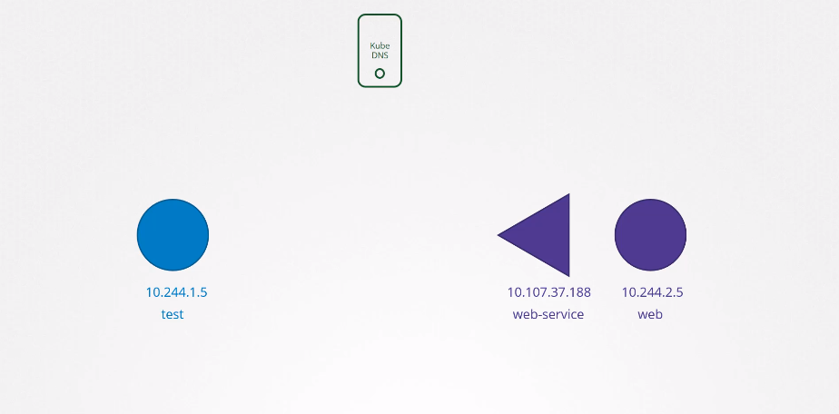

# Cluster DNS
Quando criamos um cluster cada Node possui um endereco IP e respectivamente possui um nome (dominio) que representa esse IP.  
Por padrao o K8s possui um servidor DNS que resolve os nomes dos Pods e Services instalados no cluster, esse servidor eh chamado `Kube-DNS`.  
  
Vejamos o exemplo a seguir entre dois Pods.  
  
  
Quando um Service eh criado o Kube-DNS cria um regsitro para o endereco do Service criado. Dessa forma o Pod `test` pode se conectar com o Pod `web` chamando `http://web-service` e com isso o Kube-DNS ira resolver esse nome e direcionar para o endereco de `web`.  
  
Agora, se os Pods estiverem em namespaces diferentes eh necessario adicionar o nome do namespace onde `web` esta. Ou seja, supondo que `web` esteja em um namespace chamado `apps` o endereco devera ser `http://web-service.apps`.  
  
Alem disso, todos os Services do cluster pertencem a um subdominio gerenciado pelo Kube-DNS chamado `svc`. Logo podemos chamar `web` da seguinte forma tambem `http://web-service.apps.svc`.  
  
Se juntarmos os Pods e os Services, eles pertecem a um dominio raiz chamado `cluster.local`. Portando tambem eh valido chamarmos `web` da seguinte forma `http://web-service.apps.svc.cluster.local`. Esse eh o nome completo do Service `web-service`!  
  
**_Existe alguma forma de criar um registro diretamente para um Pod?_**  
Por padrao o Kubernetes nao faz isso mas podemos habilitar isso nas configuracoes do cluster. Dessa forma, o Kube-DNS cria um nome baseado no IP do Pod trocando os `.` por `-`.  
Por exemplo, se o IP do Pod for `10.97.24.8` o registro desse Pod sera `10-97-24-8`.  
  
Tendo um regtistro podemos fazer a mesma coisa com os Services e chamar pelo endereco completo. Nesse caso como se trata de um Pod ele ira pertencer ao subdominio `pod` ao inves de `svc`.  Entao ficaria `http://10-97-24-8.apps.pod.cluster.local`.  
  
## Core DNS no Kubernetes
O Core DNS eh instalado como um Pod no namespace `kube-system` dentro do cluster.  Geralmente existem 2 Pods com uma medida de redundancia.  
Dentro dos Pods roda o executavel do CoreDNS esse executavel le um arquivo de configuracoes proprio encontrado em `/etc/coredns/Corefile`. Voce tambem pode encontrar pelo Configmap chamado `coredns`.  
```txt
.:53 {
  errors
  health {
      lameduck 5s
  }
  ready
  kubernetes cluster.local in-addr.arpa ip6.arpa {
      pods insecure
      fallthrough in-addr.arpa ip6.arpa
      ttl 30
  }
  prometheus :9153
  forward . /etc/resolv.conf {
      max_concurrent 1000
  }
  cache 30
  loop
  reload
  loadbalance
}
```  
Caso queira configurar o CoreDNS eh necessario editar o Configmap `coredns`.  
  
Quando os Pods sao criados o `kubelet` configura o endereco do Kube-DNS para que seja usado pelos Pods toda vez que precisarem chamar um Service ou outro Pod. Isso acontece por que toda configuracao eh feita nos arquivos chave como `resolv.conf` e `hosts`.  
  
**OBSERVACAO**  
Caso um Pod tente acessar outro Pod, eh necessario chamar pelo nome do registro completo. Apenas para os Services as configuracoes de apelidos sao feitas. Portanto deve-se usar `namespace.pod.cluster.local` ao chamar um Pod atraves de um outro Pod.  
  
### **DICA**
Importante saber usar ferramentas como `nslookup` e `dig` para debuggar problemas em resolucao de nomes na rede.  