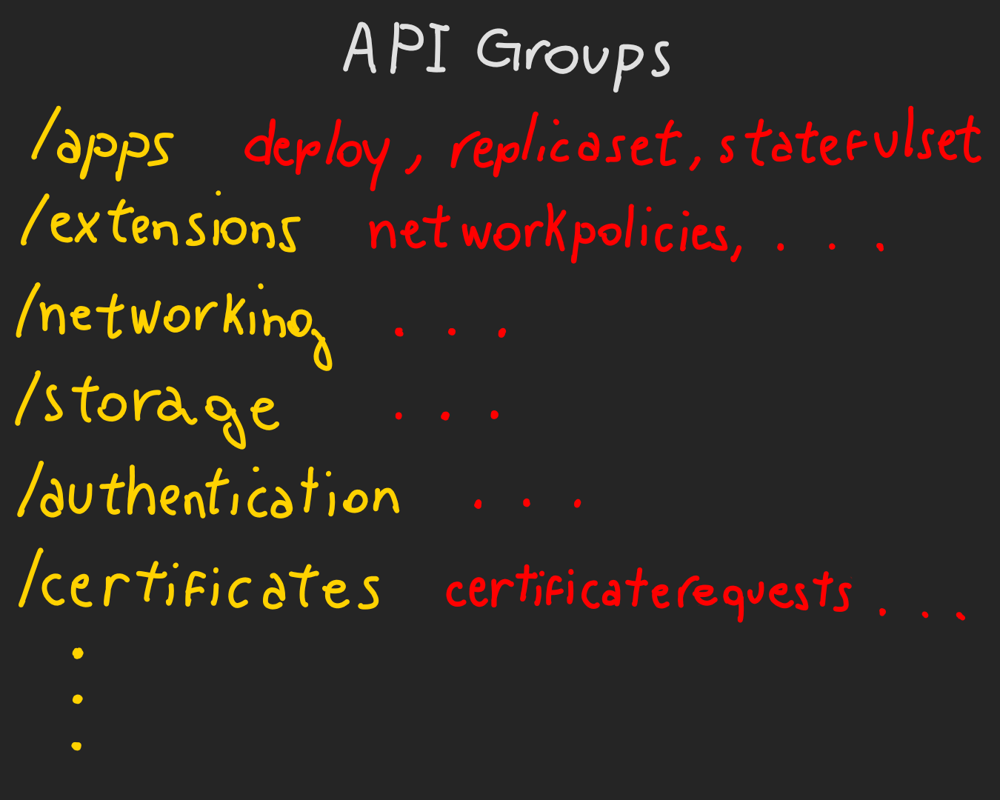

# API Groups
Os agentes do Kubernetes sao versionados por API Groups onde determina como sera o funcionamento do agente criado.  
Existem dois principais API Groups que devem receber atencao:
- `/api` (core): compostos por apenas uma unica API chamada `api/v1`.  
  
  
- `/named`: representa os demais agentes que possuem seus proprios verbos dentro do cluster (e.g. create, watch, approve, delete).  
  
  
Podemos descobrir os API Groups do cluster atraves das seguintes formas:  
Com o kubectl:  
```sh
kubectl api-resources
```

Ou com um port-forward com o seguinte comando:  
```sh
kubectl proxy
```
Feito o port-forward podemos usar a API do kubernetes a nosso favor:  
```sh
curl http://localhost:8001 -k
```
```json
{
  "paths": [
    "/.well-known/openid-configuration",
    "/api",
    "/api/v1",
    "/apis",
    "/apis/",
    "/apis/admissionregistration.k8s.io",
    "/apis/admissionregistration.k8s.io/v1",
    "/apis/admissionregistration.k8s.io/v1beta1",
    "/apis/apiextensions.k8s.io",
    "/apis/apiextensions.k8s.io/v1",
    "/apis/apiextensions.k8s.io/v1beta1",
    "/apis/apiregistration.k8s.io",
    "/apis/apiregistration.k8s.io/v1",
    "/apis/apiregistration.k8s.io/v1beta1",
    "/apis/apps",
    "/apis/apps/v1",
    "/apis/authentication.k8s.io",
    "/apis/authentication.k8s.io/v1",
    "/apis/authentication.k8s.io/v1beta1",
    "/apis/authorization.k8s.io",
    "/apis/authorization.k8s.io/v1",
    "/apis/authorization.k8s.io/v1beta1",
    "/apis/autoscaling",
    "/apis/autoscaling/v1",
    "/apis/autoscaling/v2beta1",
    "/apis/autoscaling/v2beta2",
    "/apis/batch",
    "/apis/batch/v1",
    "/apis/batch/v1beta1",
    "/apis/certificates.k8s.io",
    "/apis/certificates.k8s.io/v1",
    "/apis/certificates.k8s.io/v1beta1",
    "/apis/coordination.k8s.io",
    "/apis/coordination.k8s.io/v1",
    "/apis/coordination.k8s.io/v1beta1",
    "/apis/discovery.k8s.io",
    "/apis/discovery.k8s.io/v1",
    "/apis/discovery.k8s.io/v1beta1",
    "/apis/events.k8s.io",
    "/apis/events.k8s.io/v1",
    "/apis/events.k8s.io/v1beta1",
    "/apis/extensions",
    "/apis/extensions/v1beta1",
    "/apis/flowcontrol.apiserver.k8s.io",
    "/apis/flowcontrol.apiserver.k8s.io/v1beta1",
    "/apis/metrics.k8s.io",
    "/apis/networking.k8s.io",
    "/apis/networking.k8s.io/v1",
    "/apis/networking.k8s.io/v1beta1",
    "/apis/node.k8s.io",
    "/apis/node.k8s.io/v1",
    "/apis/node.k8s.io/v1beta1",
    "/apis/policy",
    "/apis/policy/v1",
    "/apis/policy/v1beta1",
    "/apis/rbac.authorization.k8s.io",
    "/apis/rbac.authorization.k8s.io/v1",
    "/apis/rbac.authorization.k8s.io/v1beta1",
    "/apis/scheduling.k8s.io",
    "/apis/scheduling.k8s.io/v1",
    "/apis/scheduling.k8s.io/v1beta1",
    "/apis/storage.k8s.io",
    "/apis/storage.k8s.io/v1",
    "/apis/storage.k8s.io/v1beta1",
    "/healthz",
    "/healthz/autoregister-completion",
    "/healthz/etcd",
    "/healthz/log",
    "/healthz/ping",
    "/healthz/poststarthook/aggregator-reload-proxy-client-cert",
    "/healthz/poststarthook/apiservice-openapi-controller",
    "/healthz/poststarthook/apiservice-registration-controller",
    "/healthz/poststarthook/apiservice-status-available-controller",
    "/healthz/poststarthook/bootstrap-controller",
    "/healthz/poststarthook/crd-informer-synced",
    "/healthz/poststarthook/generic-apiserver-start-informers",
    "/healthz/poststarthook/kube-apiserver-autoregistration",
    "/healthz/poststarthook/priority-and-fairness-config-consumer",
    "/healthz/poststarthook/priority-and-fairness-config-producer",
    "/healthz/poststarthook/priority-and-fairness-filter",
    "/healthz/poststarthook/rbac/bootstrap-roles",
    "/healthz/poststarthook/scheduling/bootstrap-system-priority-classes",
    "/healthz/poststarthook/start-apiextensions-controllers",
    "/healthz/poststarthook/start-apiextensions-informers",
    "/healthz/poststarthook/start-cluster-authentication-info-controller",
    "/healthz/poststarthook/start-kube-aggregator-informers",
    "/healthz/poststarthook/start-kube-apiserver-admission-initializer",
    "/livez",
    "/livez/autoregister-completion",
    "/livez/etcd",
    "/livez/log",
    "/livez/ping",
    "/livez/poststarthook/aggregator-reload-proxy-client-cert",
    "/livez/poststarthook/apiservice-openapi-controller",
    "/livez/poststarthook/apiservice-registration-controller",
    "/livez/poststarthook/apiservice-status-available-controller",
    "/livez/poststarthook/bootstrap-controller",
    "/livez/poststarthook/crd-informer-synced",
    "/livez/poststarthook/generic-apiserver-start-informers",
    "/livez/poststarthook/kube-apiserver-autoregistration",
    "/livez/poststarthook/priority-and-fairness-config-consumer",
    "/livez/poststarthook/priority-and-fairness-config-producer",
    "/livez/poststarthook/priority-and-fairness-filter",
    "/livez/poststarthook/rbac/bootstrap-roles",
    "/livez/poststarthook/scheduling/bootstrap-system-priority-classes",
    "/livez/poststarthook/start-apiextensions-controllers",
    "/livez/poststarthook/start-apiextensions-informers",
    "/livez/poststarthook/start-cluster-authentication-info-controller",
    "/livez/poststarthook/start-kube-aggregator-informers",
    "/livez/poststarthook/start-kube-apiserver-admission-initializer",
    "/logs",
    "/metrics",
    "/openapi/v2",
    "/openid/v1/jwks",
    "/readyz",
    "/readyz/autoregister-completion",
    "/readyz/etcd",
    "/readyz/informer-sync",
    "/readyz/log",
    "/readyz/ping",
    "/readyz/poststarthook/aggregator-reload-proxy-client-cert",
    "/readyz/poststarthook/apiservice-openapi-controller",
    "/readyz/poststarthook/apiservice-registration-controller",
    "/readyz/poststarthook/apiservice-status-available-controller",
    "/readyz/poststarthook/bootstrap-controller",
    "/readyz/poststarthook/crd-informer-synced",
    "/readyz/poststarthook/generic-apiserver-start-informers",
    "/readyz/poststarthook/kube-apiserver-autoregistration",
    "/readyz/poststarthook/priority-and-fairness-config-consumer",
    "/readyz/poststarthook/priority-and-fairness-config-producer",
    "/readyz/poststarthook/priority-and-fairness-filter",
    "/readyz/poststarthook/rbac/bootstrap-roles",
    "/readyz/poststarthook/scheduling/bootstrap-system-priority-classes",
    "/readyz/poststarthook/start-apiextensions-controllers",
    "/readyz/poststarthook/start-apiextensions-informers",
    "/readyz/poststarthook/start-cluster-authentication-info-controller",
    "/readyz/poststarthook/start-kube-aggregator-informers",
    "/readyz/poststarthook/start-kube-apiserver-admission-initializer",
    "/readyz/shutdown",
    "/version"
  ]
}
```  
  
### Importante
**Vale ressaltar que o `kubectl proxy` eh diferente do Kube Proxy. O Kube Proxy eh responsavel pela conectividade entre Pods e Services entre Nodes do cluster.**