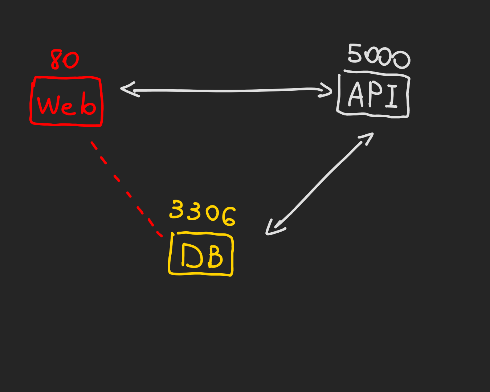

# Network Policy
Primeiro precisamos entender sobre `Ingress` e `Egress`.  
  
Ingress representa as requisicoes feitas para o servidor/host de maneira externa.  
  
Egress sao as requisicoes que se originam do servidor e sao direcionadas para algum outro host (um outro server, um banco de dados, etc).  
  
No Kubernetes por padrao todos os Pods conseguem realizar e receber chamadas de quaisquer outros Pods dentro do cluster, independente do Node em que estao, essa regra eh chamada _All Allow_ traffic.  
Essa comunicacao pode ser feita atraves dos Services de cada Pod sem precisar configurar nenhuma rota previamente.  
  
Vamos supor o seguinte cenario, imagine que temos uma API backend, um WebServer rodando o frontend e um banco de dados para persistencia.  
Como explicado anteriormente, todos os Pods terao acesso entre si, isso quer dizer que ate mesmo o frontend tera como realizar chamadas diretamente para o banco de dados. Isso nao faz sentido!  
  
  
  
Para evitar isso usamos o `NetworkPolicy`!  
Portanto eh necessario configurar ma NetworkPolicy no Pod do Banco de Dados para que receba somente chamadas do `Ingress` que tenham origem da API backend que batam na porta `3306`!  
  
### De que maneira configuramos o NetworkPolicy?
Atraves de labels, como no exemplo abaixo:  
Primeiro atribuimos um label no Pod para poder fazer o match com o `Ingress`
```yaml
[manifesto de Pod omitido]
metadata:
  labels:
    app: db
[manifesto de Pod omitido]
```  
Depois disso criamos nosso manifesto do NetworkPolicy e atribuimos o Pod pelo label.  
```yaml
apiVersion: networking.k8s.io/v1
kind: NetworkPolicy
metadata:
  name: meu-network-policy
spec:
  podSelector:
    matchLabels:
      app: db  # <== AQUI ACONTECE O MATCH COM O POD
  policyTypes:
  - Ingress  # <== DECLARAMOS QUE VAI SER DO TIPO INGRESS
  ingress:
  - from:    # <== DECLARAMOS A FORMA COMO O MATCH SERA FEITO
    - podSelector:
        matchLabels:
          app: backend  # <== IRA BUSCAR PELO PODE COM LABEL app:backend
    ports:
    - protocol: TCP
      port: 3306
```  
Acima podemos ver que a NetworkPolicy ira buscar o backend pelo label atribuido a ele. Existem outras formas de buscar o Pod dentro do campo `from`, [aqui](https://kubernetes.io/pt-br/docs/concepts/services-networking/network-policies/#comportamento-dos-seletores-to-e-from) voce encontra mais formas de fazer isso.  
  
### Importante
Vale lembrar que no exemplo acima o Pod do DB nao ira conseguir realizar chamadas para o Pod da API, caso queira que isso acontece eh necessario definir a regra para `Egress`.