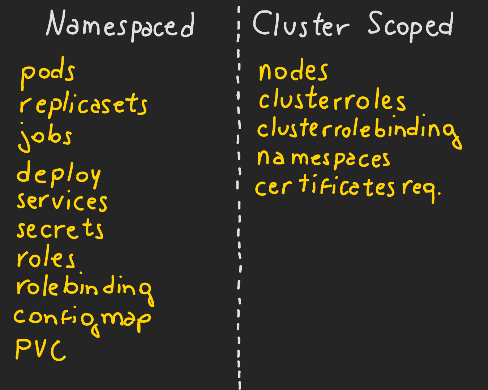

# RBAC (Role Based Access Controll)
Como fazemos para criar uma Role? Basta aplciar o seguinte manifesto:  
```yaml
apiVersion: rbac.authorization.k8s.io/v1
kind: Role
metadata:
  name: leitor-pods
rules:
- apiGroups: [""] # "" indica o core API group
  resources: ["pods"]
  verbs: ["get", "watch", "list"]
```  
No exemplo acima a Role chamada "leitor-pods" define ao usuario que podera aplicar somente os verbos `get, watch, list` nos Pods.    
Podemos colocar varias `rules` no manifesto.  
  
Apos criar a role eh necessario atribui-la para algum usuario ou grupo de usuarios.  Assim, criamos o `RoleBinding`.  
```yaml
apiVersion: rbac.authorization.k8s.io/v1
kind: RoleBinding
metadata:
  name: leitor-pods
subjects:
- kind: User
  name: rafael # "name" eh case sensitive
  apiGroup: rbac.authorization.k8s.io
roleRef:
  kind: Role # aqui atribuimos a Role ou ClusterRole
  name: leitor-pods # o nome precisa ser o mesmo do Role ou ClusterRole criado
  apiGroup: rbac.authorization.k8s.io
```  
Podemos tambem incluir uma Role e RoleBinding em um namespace especifico, basta adicionar no campo de `metadata`.  
Podemos visualizar as Roles e RoleBindings:  
```sh
kubectl get roles
kubectl get rolebindings
kubectl describe roles <nome-role>
kubectl describe rolebindings <nome-rolebinding>
```  
  
## Como checkar permissoes de usuario?
Podemos descobrir nossas permissoes como usuario da seguinte forma:  
```sh
kubectl auth can-i <verbo> <resource>
```  
Exemplo:
```sh
kubectl auth can-i delete nodes
```  
  
Podemos tambem saber se outro tipo de usuario tem permissao para fazer determinada acao. Veja o exemplo com o usuario `dev-user`:  
```sh
kubectl auth can-i delete nodes --as dev-user
```  
  
## Especificando recursos com RBAC
Na Role voce pode especificar o recurso que o usuario tem permissao atraves do nome atribuido ao recurso.  
```yaml
apiVersion: rbac.authorization.k8s.io/v1
kind: Role
metadata:
  name: leitor-pods
rules:
- apiGroups: [""] # "" indica o core API group
  resources: ["pods"]
  verbs: ["get", "watch", "list"]
  resourceNames: ["api-go", "nginx"] # <=== AQUI
```  

## Um pouco sobre namespaces
Os nodes que compoem o cluster nao podem pertencer a um namespace, Node sao recursos com escopo global. Existem dois tipos de escopo para os recursos do Kubernetes, os _namespaced_ e _cluster scoped_.  
  
  
Para resolver esse problema existe o ClusterRoleBinding e ClusterRole.  
  
## ClusterRole e ClusterRoleBinding
Seguem a mesma premissa do Role e RoleBinding, porem usam o escopo global dentro do cluster, podem ser validos dentro de qualquer namespace.  
Veja um exemplo de ClusterRole:  
```yaml
apiVersion: rbac.authorization.k8s.io/v1
kind: ClusterRole
metadata:
  name: monitoring-endpoints
rules:
- apiGroups: [""]
  resources: ["services", "endpoints", "pods"]
  verbs: ["get", "list", "watch"]
```  
Aplicamos esse ClusterRole em um ClusterRoleBinding:  
```yaml
apiVersion: rbac.authorization.k8s.io/v1
kind: ClusterRoleBinding
metadata:
  name: monitoring-binding
subjects:
- kind: Group
  name: monitoring
  apiGroup: rbac.authorization.k8s.io
roleRef:
  kind: ClusterRole
  name: monitoring-endpoints
  apiGroup: rbac.authorization.k8s.io
```  
Estamos aplicando o ClusterRole `monitoring-endpoints` para o grupo `monitoring` atraves do ClusterRoleBinding `monitoring-binding`.  
  
